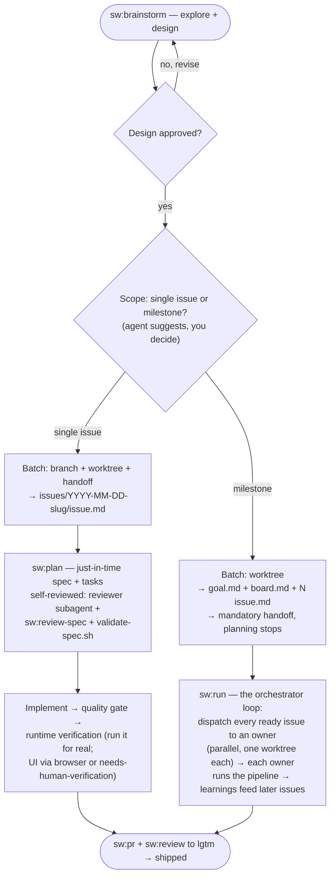

# specwright

`specwright` gives any repository an explicit **issue-driven workflow** — every non-trivial change becomes an **issue** (1 issue = 1 branch = 1 PR) running through one pipeline: brainstorm → issue → spec + tasks → implement → quality gate → runtime verification → PR → review-to-`lgtm`. Large deliveries become **milestones**: a goal, a live board, and issues conducted in a loop by an orchestrator. Agent-agnostic and self-hosting.

---

## Install

From your project root:

```bash
curl -fsSL https://raw.githubusercontent.com/ribeirogab/specwright/main/install.sh | sh
```

This:

- installs the scaffolder skill — `.agents/skills/sw/`, plus the `.claude/skills/sw` symlink, and
- enables the `sw` plugin in `.claude/settings.json`.

Then open the repo in your agent and run `/sw` to audit and scaffold the `.specwright/` vault. The plugin commands (`/sw:spec`, `/sw:pr`, …) load once Claude Code trusts the workspace.

## Use

Point an agent at any repo where you want specwright installed:

> "Audit specwright in this repo and scaffold whatever is missing."

The skill is audit-first, autonomous-fix, and safe to re-run. After the first run the repo has a working `.specwright/` vault, the bundled `sw-*` companion skills, the `/sw:*` slash commands, and an `AGENTS.md` — all dogfood-tested by specwright's own validator.

**Source:** [`skills/sw/SKILL.md`](skills/sw/SKILL.md)

## What you get

After install the repo has:

- an **`AGENTS.md`** describing the issue-driven workflow,
- a **`.specwright/` vault** holding `conventions/` (project-specific conventions), `issues/` (dated standalone-issue folders), and `milestones/` (dated milestone folders), and
- a set of **`/sw:*` commands** and companion skills:

| Command | What it does |
|---|---|
| `/sw` | Scaffold or audit specwright in the current repo — set up, verify, or fix. Idempotent. |
| `/sw:brainstorm` | Explore intent and design before any non-trivial change → an issue or a milestone. |
| `/sw:spec` | Turn the current conversation into an issue and enter the flow. |
| `/sw:plan` | The issue pipeline: just-in-time `spec.md` + `tasks.md`, gates, delivery. |
| `/sw:run` | Conduct a milestone: dispatch every ready issue, track the board, close out. |
| `/sw:review` | Review the branch diff with find-only subagents until `lgtm`. |
| `/sw:review-spec` | External-evaluator pass over an issue's plan — flags vagueness, scope creep, drift. |
| `/sw:pr` | Open the issue's PR — branch/base, push, PR template, Conventional-Commit title. |
| `/sw:update` | Sync the installed specwright with upstream without clobbering local edits. |

## How the flow works

Every non-trivial change runs through one pipeline. **Design approval is the only human review** — everything after it runs on its own; your other control points are merging the PRs and the circuit-breaker reports.



A few things worth knowing:

- **One human gate.** You approve the design — nothing else. The agent reviews its *own* plan (the spec-document-reviewer subagent + `/sw:review-spec` + the `validate-spec.sh` mechanical gate). Design approval is the standing consent to commit, push, open the PR, and review to `lgtm`.
- **Issues everywhere.** The unit of work is one folder — `issue.md` (ticket + `AC-N` + `status:`), `spec.md`, `tasks.md`, optional `learnings.md` — identical standalone and inside milestones.
- **Milestones run as a loop.** The orchestrator (`/sw:run`) never touches code: it dispatches issue owners, tracks the live `board.md`, carries curated learnings from shipped issues into later plans, and stops on circuit breakers (three identical failures → `blocked` + a report) instead of thrashing.
- **Runtime verification.** Before any PR, the agent executes what it built and checks each `AC-N` by observed behavior — UI through a browser when the agent has one, otherwise the criterion is marked `needs-human-verification`, never faked.
- **Worktree.** A specwright-native checkout under `.specwright/worktrees/` — default yes; mandatory for parallel milestone dispatch.
- **Handoff.** Fresh context per phase: optional for a standalone issue, mandatory after milestone planning (the planning session never conducts — `/sw:run` resumes from the board in any new session).

## Customizing

The workflow ships with opinionated defaults — all plain markdown, so change them to fit your team.

Companion skills live in **three kept-in-sync copies**:

- `.agents/skills/sw-<name>/` — canonical, what non-Claude agents read,
- `plugins/sw/skills/<name>/` — the Claude Code plugin copy,
- `skills/sw/scaffold/skills/sw-<name>/` — what new installs receive.

Edit the copy your agent loads. To change what **future** installs get, edit the `scaffold/` copy too — and keep the three in sync.

- **PR conventions (`/sw:pr`)** — title/body format, the draft-vs-ready choice, labels, the PR-template fill, push behavior all live in the `sw-pr` `SKILL.md`. Edit it to change how PRs are opened (e.g. write the body in another language, change the default base branch, or add labels).
- **Review rules (`/sw:review`)** — there are two levers. (1) **Project conventions** the reviewer reads: your installed repo's `.specwright/conventions/` — edit those to change the project-specific standard. (2) **The universal rubric** — the embedded rubric and severity classes (`blocker`/`suggestion`/`nitpick`/`question`), the blocker calibration, and the output format — live in the `sw-review` `SKILL.md` (Unix philosophy + meaningful comments + security are baked in).
- **Orchestration (`/sw:run`)** — the dispatch rules, circuit-breaker thresholds, and closeout behavior live in the `sw-run` `SKILL.md`; the board/goal/issue shapes live in `skills/sw/scaffold/templates/`.
- **The issue-flow steps** — the flow is documented in `AGENTS.md` under `### Issue flow`. To change the steps for an already-installed repo, edit that block; to change what new installs get, edit `### Issue flow` in `skills/sw/references/agents-md-template.md` (keep the two consistent).

## Repository layout

```
specwright/
├── skills/sw/               # the scaffolder skill: SKILL.md, references/, scaffold/, scripts/
├── plugins/sw/              # Claude Code plugin — /sw:* commands (commands/) + companion skills (skills/)
├── .claude-plugin/          # marketplace manifest
├── LICENSE                  # MIT
├── NOTICE.md                # attribution for vendored validator scripts
├── CONTRIBUTING.md
├── CODE_OF_CONDUCT.md
├── SECURITY.md
└── README.md
```

The repository also contains `.agents/`, `.claude/`, and `.specwright/` — local dirs used to dogfood specwright on its own development (the bundled companion skills, the per-agent symlinks, and the maintainer's spec vault). They are not what the installer puts in your repo.

## License

This repository's original work is licensed under the [MIT License](LICENSE). The vendored validator scripts under `skills/sw/scripts/` are Apache-2.0; see [`NOTICE.md`](NOTICE.md) for attribution.

## Contributing

Pull requests welcome — see [`CONTRIBUTING.md`](CONTRIBUTING.md) for scope, the quality bar, and the per-PR checklist. By participating, you agree to the [Code of Conduct](CODE_OF_CONDUCT.md). Security concerns go to [`SECURITY.md`](SECURITY.md).
